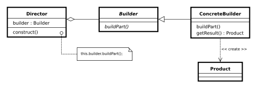

<html>
<h1>builder_design_pattern_how-to-do-in-java</h1>
 original source: <a href="https://howtodoinjava.com/design-patterns/creational/builder-pattern-in-java/" _target="blank">link</a>

The builder pattern, as name implies, is an alternative way to construct complex objects. This should be used only when you want to build different immutable objects using same object building process.

What is mentioned in GangOfFour “Design Patterns” book:
<i>The builder pattern is a design pattern that allows for the step-by-step creation of complex objects using the correct sequence of actions. The construction is controlled by a director object that only needs to know the type of object it is to create.</i>

And book gives example like below:

"I really find it hard making use of above example in real life programming and applications. Above process is very much similar (not exactly) to Abstract factory pattern, where you find a factory (or builder) for a specific type of object, and then factory gives you a concrete instance of that object. The only big difference between this builder pattern and abstract factory pattern is that, builder provides you more control over the object creation process and that’s it. Apart from it, there are no major differences."

In one sentence, abstract factory pattern is the answer to <code>"WHAT"</code> and the builder pattern to <code>"HOW"</code>.

For me, a builder pattern is more like <strong><a href="https://en.wikipedia.org/wiki/Fluent_interface" title="Fluent_interface">fluent interface</a></strong>. A fluent interface is normally implemented by using <strong>method cascading</strong> (or method chaining).

Now from here, I will start discussing builder pattern the way I find it useful specially in practical cases. And I hope to convince you guys as well.
<pre><strong>Sections in this post:</strong>

Definition of Builder Pattern
Where we need Builder Pattern
A sample implementation using Builder Pattern
Existing implementations in JDK
Benefits and Advantages
Costs and Disadvantages
Conclusion
</pre><h2>Definition of Builder Pattern</h2>
Let’s start by a giving a definition to builder pattern:
<blockquote>

Builder pattern aims to “Separate the construction of a complex object from its representation so that the same construction process can create different representations.”
</blockquote><h2>Where we need Builder Pattern</h2>
We already know the benefits of <strong><a href="//howtodoinjava.com/java/related-concepts/how-to-make-a-java-class-immutable/" title="How to make a java class immutable">immutability</a></strong> and immutable instances in application. If you have any question over it, the please let me remind you of <code>String</code> class in java. And as I already said, builder pattern helps us in creating immutable classes with large set of state attributes.

Let’s discuss a common problem in our application. In any user management module, primary entity is <code>User</code>, let’s say. Ideally and practically as well, once a user object is fully created, you will not want to change it’s state. It simply does not make sense, right? Now, let’s assume, our User object has following 5 attributes i.e. <code>firstName</code>, <code>lastName</code>, <code>age</code>, <code>phone</code> and <code>address</code>.

In normal practice, if you want to make a immutable <code>User</code> class, then you must pass all five information as parameters to constructor. It will look like this:

<table border="0" cellpadding="0" cellspacing="0"><tbody><tr><td class="code">

<code class="java keyword">public</code> <code class="java plain">User (String firstName, String lastName, </code><code class="java keyword">int</code> <code class="java plain">age, String phone, String address){</code>

<code class="java spaces">&nbsp;&nbsp;&nbsp;&nbsp;</code><code class="java keyword">this</code><code class="java plain">.firstName = firstName;</code>

<code class="java spaces">&nbsp;&nbsp;&nbsp;&nbsp;</code><code class="java keyword">this</code><code class="java plain">.lastName = lastName;</code>

<code class="java spaces">&nbsp;&nbsp;&nbsp;&nbsp;</code><code class="java keyword">this</code><code class="java plain">.age = age;</code>

<code class="java spaces">&nbsp;&nbsp;&nbsp;&nbsp;</code><code class="java keyword">this</code><code class="java plain">.phone = phone;</code>

<code class="java spaces">&nbsp;&nbsp;&nbsp;&nbsp;</code><code class="java keyword">this</code><code class="java plain">.address = address;</code>

<code class="java plain">}</code>

</td></tr></tbody></table>

Very good. Now what if only <code>firstName</code> and <code>lastName</code> are <strong>mandatory</strong> and rest 3 fields are optional. Problem !! We need more constructors.

<table border="0" cellpadding="0" cellspacing="0"><tbody><tr><td class="code">

<code class="java keyword">public</code> <code class="java plain">User (String firstName, String lastName, </code><code class="java keyword">int</code> <code class="java plain">age, String phone){ ... }</code>

<code class="java keyword">public</code> <code class="java plain">User (String firstName, String lastName, String phone, String address){ ...&nbsp; }</code>

<code class="java keyword">public</code> <code class="java plain">User (String firstName, String lastName, </code><code class="java keyword">int</code> <code class="java plain">age){ ...&nbsp;&nbsp; }</code>

<code class="java keyword">public</code> <code class="java plain">User (String firstName, String lastName){ ...&nbsp;&nbsp;&nbsp; }</code>

</td></tr></tbody></table>

We will need some more like above. Still can manage? Now let’s introduce our sixth attribute i.e. salary. Now it is problem.

<em>One way it to create more constructors, and another is to loose the immutability and introduce setter methods. You choose any of both options, you loose something, right?</em>

Here, builder pattern will help you to consume additional attributes while retaining the immutability of Use class.
<h2>A sample implementation using Builder Pattern</h2>
Below is the coded solution of problem we discussed above. This uses a additional class <code>UserBuilder</code> which helps us in building desired User object with all mandatory attributes and combination of optional attributes, without loosing the immutability.

<table border="0" cellpadding="0" cellspacing="0"><tbody><tr><td class="code">

<code class="java keyword">public</code> <code class="java keyword">class</code> <code class="java plain">User </code>

<code class="java plain">{</code>

<code class="java spaces">&nbsp;&nbsp;&nbsp;&nbsp;</code><code class="java comments">//All final attributes</code>

<code class="java spaces">&nbsp;&nbsp;&nbsp;&nbsp;</code><code class="java keyword">private</code> <code class="java keyword">final</code> <code class="java plain">String firstName; </code><code class="java comments">// required</code>

<code class="java spaces">&nbsp;&nbsp;&nbsp;&nbsp;</code><code class="java keyword">private</code> <code class="java keyword">final</code> <code class="java plain">String lastName; </code><code class="java comments">// required</code>

<code class="java spaces">&nbsp;&nbsp;&nbsp;&nbsp;</code><code class="java keyword">private</code> <code class="java keyword">final</code> <code class="java keyword">int</code> <code class="java plain">age; </code><code class="java comments">// optional</code>

<code class="java spaces">&nbsp;&nbsp;&nbsp;&nbsp;</code><code class="java keyword">private</code> <code class="java keyword">final</code> <code class="java plain">String phone; </code><code class="java comments">// optional</code>

<code class="java spaces">&nbsp;&nbsp;&nbsp;&nbsp;</code><code class="java keyword">private</code> <code class="java keyword">final</code> <code class="java plain">String address; </code><code class="java comments">// optional</code>

&nbsp;

<code class="java spaces">&nbsp;&nbsp;&nbsp;&nbsp;</code><code class="java keyword">private</code> <code class="java plain">User(UserBuilder builder) {</code>

<code class="java spaces">&nbsp;&nbsp;&nbsp;&nbsp;&nbsp;&nbsp;&nbsp;&nbsp;</code><code class="java keyword">this</code><code class="java plain">.firstName = builder.firstName;</code>

<code class="java spaces">&nbsp;&nbsp;&nbsp;&nbsp;&nbsp;&nbsp;&nbsp;&nbsp;</code><code class="java keyword">this</code><code class="java plain">.lastName = builder.lastName;</code>

<code class="java spaces">&nbsp;&nbsp;&nbsp;&nbsp;&nbsp;&nbsp;&nbsp;&nbsp;</code><code class="java keyword">this</code><code class="java plain">.age = builder.age;</code>

<code class="java spaces">&nbsp;&nbsp;&nbsp;&nbsp;&nbsp;&nbsp;&nbsp;&nbsp;</code><code class="java keyword">this</code><code class="java plain">.phone = builder.phone;</code>

<code class="java spaces">&nbsp;&nbsp;&nbsp;&nbsp;&nbsp;&nbsp;&nbsp;&nbsp;</code><code class="java keyword">this</code><code class="java plain">.address = builder.address;</code>

<code class="java spaces">&nbsp;&nbsp;&nbsp;&nbsp;</code><code class="java plain">}</code>

&nbsp;

<code class="java spaces">&nbsp;&nbsp;&nbsp;&nbsp;</code><code class="java comments">//All getter, and NO setter to provde immutability</code>

<code class="java spaces">&nbsp;&nbsp;&nbsp;&nbsp;</code><code class="java keyword">public</code> <code class="java plain">String getFirstName() {</code>

<code class="java spaces">&nbsp;&nbsp;&nbsp;&nbsp;&nbsp;&nbsp;&nbsp;&nbsp;</code><code class="java keyword">return</code> <code class="java plain">firstName;</code>

<code class="java spaces">&nbsp;&nbsp;&nbsp;&nbsp;</code><code class="java plain">}</code>

<code class="java spaces">&nbsp;&nbsp;&nbsp;&nbsp;</code><code class="java keyword">public</code> <code class="java plain">String getLastName() {</code>

<code class="java spaces">&nbsp;&nbsp;&nbsp;&nbsp;&nbsp;&nbsp;&nbsp;&nbsp;</code><code class="java keyword">return</code> <code class="java plain">lastName;</code>

<code class="java spaces">&nbsp;&nbsp;&nbsp;&nbsp;</code><code class="java plain">}</code>

<code class="java spaces">&nbsp;&nbsp;&nbsp;&nbsp;</code><code class="java keyword">public</code> <code class="java keyword">int</code> <code class="java plain">getAge() {</code>

<code class="java spaces">&nbsp;&nbsp;&nbsp;&nbsp;&nbsp;&nbsp;&nbsp;&nbsp;</code><code class="java keyword">return</code> <code class="java plain">age;</code>

<code class="java spaces">&nbsp;&nbsp;&nbsp;&nbsp;</code><code class="java plain">}</code>

<code class="java spaces">&nbsp;&nbsp;&nbsp;&nbsp;</code><code class="java keyword">public</code> <code class="java plain">String getPhone() {</code>

<code class="java spaces">&nbsp;&nbsp;&nbsp;&nbsp;&nbsp;&nbsp;&nbsp;&nbsp;</code><code class="java keyword">return</code> <code class="java plain">phone;</code>

<code class="java spaces">&nbsp;&nbsp;&nbsp;&nbsp;</code><code class="java plain">}</code>

<code class="java spaces">&nbsp;&nbsp;&nbsp;&nbsp;</code><code class="java keyword">public</code> <code class="java plain">String getAddress() {</code>

<code class="java spaces">&nbsp;&nbsp;&nbsp;&nbsp;&nbsp;&nbsp;&nbsp;&nbsp;</code><code class="java keyword">return</code> <code class="java plain">address;</code>

<code class="java spaces">&nbsp;&nbsp;&nbsp;&nbsp;</code><code class="java plain">}</code>

&nbsp;

<code class="java spaces">&nbsp;&nbsp;&nbsp;&nbsp;</code><code class="java color1">@Override</code>

<code class="java spaces">&nbsp;&nbsp;&nbsp;&nbsp;</code><code class="java keyword">public</code> <code class="java plain">String toString() {</code>

<code class="java spaces">&nbsp;&nbsp;&nbsp;&nbsp;&nbsp;&nbsp;&nbsp;&nbsp;</code><code class="java keyword">return</code> <code class="java string">"User: "</code><code class="java plain">+</code><code class="java keyword">this</code><code class="java plain">.firstName+</code><code class="java string">", "</code><code class="java plain">+</code><code class="java keyword">this</code><code class="java plain">.lastName+</code><code class="java string">", "</code><code class="java plain">+</code><code class="java keyword">this</code><code class="java plain">.age+</code><code class="java string">", "</code><code class="java plain">+</code><code class="java keyword">this</code><code class="java plain">.phone+</code><code class="java string">", "</code><code class="java plain">+</code><code class="java keyword">this</code><code class="java plain">.address;</code>

<code class="java spaces">&nbsp;&nbsp;&nbsp;&nbsp;</code><code class="java plain">}</code>

&nbsp;

<code class="java spaces">&nbsp;&nbsp;&nbsp;&nbsp;</code><code class="java keyword">public</code> <code class="java keyword">static</code> <code class="java keyword">class</code> <code class="java plain">UserBuilder </code>

<code class="java spaces">&nbsp;&nbsp;&nbsp;&nbsp;</code><code class="java plain">{</code>

<code class="java spaces">&nbsp;&nbsp;&nbsp;&nbsp;&nbsp;&nbsp;&nbsp;&nbsp;</code><code class="java keyword">private</code> <code class="java keyword">final</code> <code class="java plain">String firstName;</code>

<code class="java spaces">&nbsp;&nbsp;&nbsp;&nbsp;&nbsp;&nbsp;&nbsp;&nbsp;</code><code class="java keyword">private</code> <code class="java keyword">final</code> <code class="java plain">String lastName;</code>

<code class="java spaces">&nbsp;&nbsp;&nbsp;&nbsp;&nbsp;&nbsp;&nbsp;&nbsp;</code><code class="java keyword">private</code> <code class="java keyword">int</code> <code class="java plain">age;</code>

<code class="java spaces">&nbsp;&nbsp;&nbsp;&nbsp;&nbsp;&nbsp;&nbsp;&nbsp;</code><code class="java keyword">private</code> <code class="java plain">String phone;</code>

<code class="java spaces">&nbsp;&nbsp;&nbsp;&nbsp;&nbsp;&nbsp;&nbsp;&nbsp;</code><code class="java keyword">private</code> <code class="java plain">String address;</code>

&nbsp;

<code class="java spaces">&nbsp;&nbsp;&nbsp;&nbsp;&nbsp;&nbsp;&nbsp;&nbsp;</code><code class="java keyword">public</code> <code class="java plain">UserBuilder(String firstName, String lastName) {</code>

<code class="java spaces">&nbsp;&nbsp;&nbsp;&nbsp;&nbsp;&nbsp;&nbsp;&nbsp;&nbsp;&nbsp;&nbsp;&nbsp;</code><code class="java keyword">this</code><code class="java plain">.firstName = firstName;</code>

<code class="java spaces">&nbsp;&nbsp;&nbsp;&nbsp;&nbsp;&nbsp;&nbsp;&nbsp;&nbsp;&nbsp;&nbsp;&nbsp;</code><code class="java keyword">this</code><code class="java plain">.lastName = lastName;</code>

<code class="java spaces">&nbsp;&nbsp;&nbsp;&nbsp;&nbsp;&nbsp;&nbsp;&nbsp;</code><code class="java plain">}</code>

<code class="java spaces">&nbsp;&nbsp;&nbsp;&nbsp;&nbsp;&nbsp;&nbsp;&nbsp;</code><code class="java keyword">public</code> <code class="java plain">UserBuilder age(</code><code class="java keyword">int</code> <code class="java plain">age) {</code>

<code class="java spaces">&nbsp;&nbsp;&nbsp;&nbsp;&nbsp;&nbsp;&nbsp;&nbsp;&nbsp;&nbsp;&nbsp;&nbsp;</code><code class="java keyword">this</code><code class="java plain">.age = age;</code>

<code class="java spaces">&nbsp;&nbsp;&nbsp;&nbsp;&nbsp;&nbsp;&nbsp;&nbsp;&nbsp;&nbsp;&nbsp;&nbsp;</code><code class="java keyword">return</code> <code class="java keyword">this</code><code class="java plain">;</code>

<code class="java spaces">&nbsp;&nbsp;&nbsp;&nbsp;&nbsp;&nbsp;&nbsp;&nbsp;</code><code class="java plain">}</code>

<code class="java spaces">&nbsp;&nbsp;&nbsp;&nbsp;&nbsp;&nbsp;&nbsp;&nbsp;</code><code class="java keyword">public</code> <code class="java plain">UserBuilder phone(String phone) {</code>

<code class="java spaces">&nbsp;&nbsp;&nbsp;&nbsp;&nbsp;&nbsp;&nbsp;&nbsp;&nbsp;&nbsp;&nbsp;&nbsp;</code><code class="java keyword">this</code><code class="java plain">.phone = phone;</code>

<code class="java spaces">&nbsp;&nbsp;&nbsp;&nbsp;&nbsp;&nbsp;&nbsp;&nbsp;&nbsp;&nbsp;&nbsp;&nbsp;</code><code class="java keyword">return</code> <code class="java keyword">this</code><code class="java plain">;</code>

<code class="java spaces">&nbsp;&nbsp;&nbsp;&nbsp;&nbsp;&nbsp;&nbsp;&nbsp;</code><code class="java plain">}</code>

<code class="java spaces">&nbsp;&nbsp;&nbsp;&nbsp;&nbsp;&nbsp;&nbsp;&nbsp;</code><code class="java keyword">public</code> <code class="java plain">UserBuilder address(String address) {</code>

<code class="java spaces">&nbsp;&nbsp;&nbsp;&nbsp;&nbsp;&nbsp;&nbsp;&nbsp;&nbsp;&nbsp;&nbsp;&nbsp;</code><code class="java keyword">this</code><code class="java plain">.address = address;</code>

<code class="java spaces">&nbsp;&nbsp;&nbsp;&nbsp;&nbsp;&nbsp;&nbsp;&nbsp;&nbsp;&nbsp;&nbsp;&nbsp;</code><code class="java keyword">return</code> <code class="java keyword">this</code><code class="java plain">;</code>

<code class="java spaces">&nbsp;&nbsp;&nbsp;&nbsp;&nbsp;&nbsp;&nbsp;&nbsp;</code><code class="java plain">}</code>

<code class="java spaces">&nbsp;&nbsp;&nbsp;&nbsp;&nbsp;&nbsp;&nbsp;&nbsp;</code><code class="java comments">//Return the finally consrcuted User object</code>

<code class="java spaces">&nbsp;&nbsp;&nbsp;&nbsp;&nbsp;&nbsp;&nbsp;&nbsp;</code><code class="java keyword">public</code> <code class="java plain">User build() {</code>

<code class="java spaces">&nbsp;&nbsp;&nbsp;&nbsp;&nbsp;&nbsp;&nbsp;&nbsp;&nbsp;&nbsp;&nbsp;&nbsp;</code><code class="java plain">User user =&nbsp; </code><code class="java keyword">new</code> <code class="java plain">User(</code><code class="java keyword">this</code><code class="java plain">);</code>

<code class="java spaces">&nbsp;&nbsp;&nbsp;&nbsp;&nbsp;&nbsp;&nbsp;&nbsp;&nbsp;&nbsp;&nbsp;&nbsp;</code><code class="java plain">validateUserObject(user);</code>

<code class="java spaces">&nbsp;&nbsp;&nbsp;&nbsp;&nbsp;&nbsp;&nbsp;&nbsp;&nbsp;&nbsp;&nbsp;&nbsp;</code><code class="java keyword">return</code> <code class="java plain">user;</code>

<code class="java spaces">&nbsp;&nbsp;&nbsp;&nbsp;&nbsp;&nbsp;&nbsp;&nbsp;</code><code class="java plain">}</code>

<code class="java spaces">&nbsp;&nbsp;&nbsp;&nbsp;&nbsp;&nbsp;&nbsp;&nbsp;</code><code class="java keyword">private</code> <code class="java keyword">void</code> <code class="java plain">validateUserObject(User user) {</code>

<code class="java spaces">&nbsp;&nbsp;&nbsp;&nbsp;&nbsp;&nbsp;&nbsp;&nbsp;&nbsp;&nbsp;&nbsp;&nbsp;</code><code class="java comments">//Do some basic validations to check </code>

<code class="java spaces">&nbsp;&nbsp;&nbsp;&nbsp;&nbsp;&nbsp;&nbsp;&nbsp;&nbsp;&nbsp;&nbsp;&nbsp;</code><code class="java comments">//if user object does not break any assumption of system</code>

<code class="java spaces">&nbsp;&nbsp;&nbsp;&nbsp;&nbsp;&nbsp;&nbsp;&nbsp;</code><code class="java plain">}</code>

<code class="java spaces">&nbsp;&nbsp;&nbsp;&nbsp;</code><code class="java plain">}</code>

<code class="java plain">}</code>

</td></tr></tbody></table>

And below is the way, we will use the <code>UserBuilder</code> in our code:

<table border="0" cellpadding="0" cellspacing="0"><tbody><tr><td class="code">

<code class="java keyword">public</code> <code class="java keyword">static</code> <code class="java keyword">void</code> <code class="java plain">main(String[] args) {</code>

<code class="java spaces">&nbsp;&nbsp;&nbsp;&nbsp;</code><code class="java plain">User user1 = </code><code class="java keyword">new</code> <code class="java plain">User.UserBuilder(</code><code class="java string">"Lokesh"</code><code class="java plain">, </code><code class="java string">"Gupta"</code><code class="java plain">)</code>

<code class="java spaces">&nbsp;&nbsp;&nbsp;&nbsp;</code><code class="java plain">.age(</code><code class="java value">30</code><code class="java plain">)</code>

<code class="java spaces">&nbsp;&nbsp;&nbsp;&nbsp;</code><code class="java plain">.phone(</code><code class="java string">"1234567"</code><code class="java plain">)</code>

<code class="java spaces">&nbsp;&nbsp;&nbsp;&nbsp;</code><code class="java plain">.address(</code><code class="java string">"Fake address 1234"</code><code class="java plain">)</code>

<code class="java spaces">&nbsp;&nbsp;&nbsp;&nbsp;</code><code class="java plain">.build();</code>

&nbsp;

<code class="java spaces">&nbsp;&nbsp;&nbsp;&nbsp;</code><code class="java plain">System.out.println(user1);</code>

&nbsp;

<code class="java spaces">&nbsp;&nbsp;&nbsp;&nbsp;</code><code class="java plain">User user2 = </code><code class="java keyword">new</code> <code class="java plain">User.UserBuilder(</code><code class="java string">"Jack"</code><code class="java plain">, </code><code class="java string">"Reacher"</code><code class="java plain">)</code>

<code class="java spaces">&nbsp;&nbsp;&nbsp;&nbsp;</code><code class="java plain">.age(</code><code class="java value">40</code><code class="java plain">)</code>

<code class="java spaces">&nbsp;&nbsp;&nbsp;&nbsp;</code><code class="java plain">.phone(</code><code class="java string">"5655"</code><code class="java plain">)</code>

<code class="java spaces">&nbsp;&nbsp;&nbsp;&nbsp;</code><code class="java comments">//no address</code>

<code class="java spaces">&nbsp;&nbsp;&nbsp;&nbsp;</code><code class="java plain">.build();</code>

&nbsp;

<code class="java spaces">&nbsp;&nbsp;&nbsp;&nbsp;</code><code class="java plain">System.out.println(user2);</code>

&nbsp;

<code class="java spaces">&nbsp;&nbsp;&nbsp;&nbsp;</code><code class="java plain">User user3 = </code><code class="java keyword">new</code> <code class="java plain">User.UserBuilder(</code><code class="java string">"Super"</code><code class="java plain">, </code><code class="java string">"Man"</code><code class="java plain">)</code>

<code class="java spaces">&nbsp;&nbsp;&nbsp;&nbsp;</code><code class="java comments">//No age</code>

<code class="java spaces">&nbsp;&nbsp;&nbsp;&nbsp;</code><code class="java comments">//No phone</code>

<code class="java spaces">&nbsp;&nbsp;&nbsp;&nbsp;</code><code class="java comments">//no address</code>

<code class="java spaces">&nbsp;&nbsp;&nbsp;&nbsp;</code><code class="java plain">.build();</code>

&nbsp;

<code class="java spaces">&nbsp;&nbsp;&nbsp;&nbsp;</code><code class="java plain">System.out.println(user3);</code>

<code class="java plain">}</code>

&nbsp;

<code class="java plain">Output:</code>

&nbsp;

<code class="java plain">User: Lokesh, Gupta, </code><code class="java value">30</code><code class="java plain">, </code><code class="java value">1234567</code><code class="java plain">, Fake address </code><code class="java value">1234</code>

<code class="java plain">User: Jack, Reacher, </code><code class="java value">40</code><code class="java plain">, </code><code class="java value">5655</code><code class="java plain">, </code><code class="java keyword">null</code>

<code class="java plain">User: Super, Man, </code><code class="java value">0</code><code class="java plain">, </code><code class="java keyword">null</code><code class="java plain">, </code><code class="java keyword">null</code>

</td></tr></tbody></table>

Please note that above created user object <strong>does not have any setter method</strong>, so it’s state can not be changed once it has been built. This provides the desired immutability.

Sometimes developers may forget to add support for a new attribute to the builder when they add that attribute to the User class. To minimize this,  we should enclose the builders inside the class (as in above example) that they build so that it’s more obvious to the developer that there is a relevant builder that needs to be updated too.
<blockquote>
Sometimes I think there should be a <strong>Destroyer pattern</strong> (opposite to builder) which should tear down certain attributes from a complex object in systematic manner. What do you think?
</blockquote><h2>Existing implementations in JDK</h2>
All implementations of <a href="https://docs.oracle.com/javase/7/docs/api/java/lang/Appendable.html" title="Appendable">java.lang.Appendable</a> are infact good example of use of Builder pattern in java. e.g.

<a href="https://docs.oracle.com/javase/7/docs/api/java/lang/StringBuilder.html#append%28java.lang.CharSequence%29" title="StringBuilder">java.lang.StringBuilder#append()</a> [Unsynchronized class]

<a href="https://docs.oracle.com/javase/1.5.0/docs/api/java/lang/StringBuffer.html#append%28java.lang.CharSequence%29" title="StringBuffer">java.lang.StringBuffer#append()</a> [Synchronized class]

<a href="https://docs.oracle.com/javase/6/docs/api/java/nio/ByteBuffer.html#put%28java.nio.ByteBuffer%29" title="ByteBuffer">java.nio.ByteBuffer#put()</a> (also on CharBuffer, ShortBuffer, IntBuffer, LongBuffer, FloatBuffer and DoubleBuffer)

Another use can be found in <a href="https://docs.oracle.com/javase/6/docs/api/javax/swing/GroupLayout.Group.html#addComponent%28java.awt.Component%29" title="GroupLayout">javax.swing.GroupLayout.Group#addComponent()</a>.

Look how similar these implementations look like what we discussed above.

<table border="0" cellpadding="0" cellspacing="0"><tbody><tr><td class="code">

<code class="java plain">StringBuilder builder = </code><code class="java keyword">new</code> <code class="java plain">StringBuilder(</code><code class="java string">"Temp"</code><code class="java plain">);</code>

<code class="java plain">String data = builder.append(</code><code class="java value">1</code><code class="java plain">)</code>

<code class="java spaces">&nbsp;&nbsp;&nbsp;&nbsp;&nbsp;&nbsp;&nbsp;&nbsp;&nbsp;&nbsp;&nbsp;&nbsp;&nbsp;&nbsp;&nbsp;&nbsp;</code><code class="java plain">.append(</code><code class="java keyword">true</code><code class="java plain">)</code>

<code class="java spaces">&nbsp;&nbsp;&nbsp;&nbsp;&nbsp;&nbsp;&nbsp;&nbsp;&nbsp;&nbsp;&nbsp;&nbsp;&nbsp;&nbsp;&nbsp;&nbsp;</code><code class="java plain">.append(</code><code class="java string">"friend"</code><code class="java plain">)</code>

<code class="java spaces">&nbsp;&nbsp;&nbsp;&nbsp;&nbsp;&nbsp;&nbsp;&nbsp;&nbsp;&nbsp;&nbsp;&nbsp;&nbsp;&nbsp;&nbsp;&nbsp;</code><code class="java plain">.toString();</code>

<code class="java plain">System.out.println(data);</code>

<code class="java plain">Output:</code>

<code class="java plain">Temp1truefriend</code>

</td></tr></tbody></table>

<h2>Benefits and Advantages of Builder Pattern</h2>
Undoubtedly, the <strong>number of lines of code increase</strong> at least to double in builder pattern, but the effort pays off in terms of <strong>design flexibility</strong> and much more <strong>readable code</strong>. The <strong>parameters to the constructor are reduced</strong> and are provided in <strong>highly readable method calls</strong>.

Builder pattern also helps minimizing the number of parameters in constructor and thus there is <strong>no need to pass in null for optional parameters</strong> to the constructor. It’s really attracts me.

Another advantage is that Object is always instantiated in a <code>complete</code> state rather than sitting in an incomplete state until the developer calls (if ever calls) the appropriate “setter” method to set additional fields.

And I finally I can build <strong>immutable objects</strong> without much complex logic in object building process.
<h2>Costs and Disadvantages of Builder Pattern</h2>
Though Builder pattern reduce some line of code buy eliminating the need of setter methods, still in <strong>double up total lines</strong> by introducing the Builder object. Furthermore, although client code is more readable, the client code is also more verbose. Though for me, readability weighs more than lines of code.

That’s only disadvantage I can think of.

That’s all for this topic. I will be happy if you share your thoughts as well.

<strong>Happy Learning !!</strong>

References

<a href="https://en.wikipedia.org/wiki/Builder_pattern">http://en.wikipedia.org/wiki/Builder_pattern</a> 
<a href="http://www.javaspecialists.eu/archive/Issue163.html">http://www.javaspecialists.eu/archive/Issue163.html</a> 
<a href="https://en.wikipedia.org/wiki/Fluent_interface">http://en.wikipedia.org/wiki/Fluent_interface</a> 
<a href="http://martinfowler.com/bliki/FluentInterface.html">http://martinfowler.com/bliki/FluentInterface.html</a>

</html>